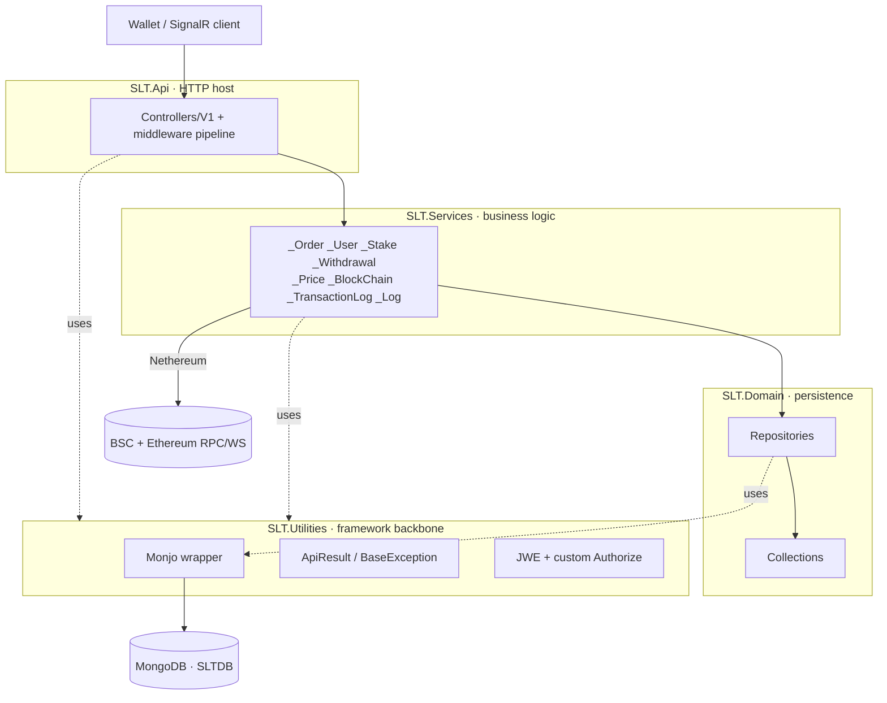

# Architecture — SLT API

SLT API is the public/trading backend for **SLT CargoPay**, a crypto invoice/order + staking
platform. Wallets create token-denominated orders/invoices, pay them on-chain, and stake tokens
for time-locked monthly profit; the API mirrors on-chain events into MongoDB and serves
read/report endpoints. Auth is by **Web3 wallet signature** (no passwords). Chains are dual EVM —
**BSC / BEP20 (ChainId 56)** and **Ethereum / ERC20** via Nethereum. **No Tron / Bitcoin.**

## Layering

Classic .NET **N-tier** (NOT Clean Architecture / DDD / CQRS / EF). Four projects, one-way
dependency chain:



`Api → Services → Domain → Utilities`. Utilities is the foundation; it owns the Monjo MongoDB
wrapper, the ApiResult envelope, the exception hierarchy, and all auth. Its types live under the
prefix-less `Utilities.*` namespace even though the assembly is `SLT.Utilities`.

## Request middleware pipeline (verbatim, `SLT.Api/Program.cs`)

```
UseHsts → UseDeveloperExceptionPage → UseSwaggerAndUI → UseRequestLogger →
UseCustomExceptionHandler → UseJWTBlackList → UseProductionCors → UseFirewall →
UseSignature → UseJwt → UseRouting → UseCustomRateLimiting → UseAuthorization → UseEndpoints
```

Then SignalR hubs are mapped: `/hubs/prices` (`PriceHub`) and `/hubs/NotifyWallet`
(`WalletNotifyHub`).

## Request lifecycle

1. **Signature gate** (`SignatureMiddleware`) — requires `ApplicationId` + `Nonce` + `Signature`
   headers; verifies an HMAC against the app's `PreSharedKey` with nonce replay protection
   (`TryUse`, 5 min). A `MasterSignature` bypasses this. SignalR hub paths are exempt.
2. **JWT parse** (`JwtMiddleware`) — reads `Authorization: Bearer …`, validates+decrypts the JWE
   via `IJwtService`, stashes the token in `HttpContext.Items["Token"]`. Does NOT reject missing
   tokens.
3. **Authorization** (custom `Utilities.Filters.AuthorizeAttribute`, NOT ASP.NET's) — `[Authorize]`
   requires a token; `RequireActiveUser` (default true) checks the `UserStatus` claim == Active.
4. Controller action delegates to one service method, returns a bare DTO; `[ApiResultFilter]` +
   `CustomExceptionHandlerMiddleware` wrap it in the `ApiResult` envelope.

## Monjo data flow

Services query through injected `IXRepository.AsQueryable()` (LINQ over `MongoDB.Driver`) or the
`MonjoQuery` filter/page DSL. Every read auto-filters `!IsDeleted`; every write auto-stamps
`ModifiedMoment`; deletes set `IsDeleted=true`. Only `RealDeleteManyAsync` hard-deletes (used by
log cleanup). `MonjoConnection` is a singleton `MongoClient` + `IMongoDatabase` (DB `SLTDB`).

## Blockchain

`BlockChainService` holds two `Web3` clients: `_bep20Web3` (with a signing hot-wallet account for
writes) and `_erc20Web3` (reads). Contract ABIs (forward-sale invoice, ERC20, stake) are embedded.
`_MultiCallService` batches `eth_call`s; `_BlockChainWebSocket` listeners (BackgroundService) sync
on-chain events into `_TransactionLog` / `_Withdrawal` / `_Order`. Normal invoice events
(`InvoiceCreated`, `InvoicePaid`) use the existing txlog → order sync path; **locked invoice**
events (`LockedInvoiceCreated`, `LockedInvoicePaid`, `LockedInvoiceApproved`,
`LockedInvoiceResolved`) use additive handlers only — normal handlers are unchanged. Invoice detail
can read live locked contract state via `GetLockedInvoiceAsync` until the invoice reaches a terminal
lock state. If no third-party approver was set, locked-created and locked-paid sync keep the
approver null and approval endpoints do not list the invoice; `LockedInvoiceResolved` decides release/refund from the emitted beneficiary. Login signature recovery uses
`Nethereum.Signer.EthereumMessageSigner` +
`Nethereum.Util.AddressUtil`.

## DI

Autofac with marker-interface scanning (`IScopedDependency`, `ISingletonDependency`,
`ITransientDependency`, `ISelfSingletonDependency`, `IHostedDependency`). A class registers by
implementing a marker and living in a scanned assembly. Scanning happens in two places:
`AutofacConfigurationExtensions.AddServices()` (Utilities) and
`ControllerAutofacConfigurationExtensions.AddControllerServices()` (Domain + Services). Settings
POCOs are the exception — bound via `RegisterSetting<T>` and injected as the plain class.

---

## Architecture Assessment

Honest read of the real code (see `docs/SECURITY.md` for the full security treatment).

### Strengths
- **Clean, consistent layering.** The `Api → Services → Domain → Utilities` chain is respected;
  controllers are genuinely thin; the `_<Module>` + DTO-tree convention is uniform and easy to
  navigate.
- **The Monjo wrapper pays for itself.** Universal soft-delete and `ModifiedMoment` stamping are
  centralized, so individual queries can't forget them. Marker-interface DI keeps wiring out of
  the way.
- **Coherent error model.** `BaseException` → `CustomExceptionHandlerMiddleware` → `ApiResult` is
  a single, predictable path; services just throw typed exceptions.

### Risks & smells
- **Committed production secrets (CRITICAL).** A blockchain hot-wallet private key and the JWT
  signing/encryption keys live in `appsettings.json` in git. This is the top risk — see SECURITY.md.
- **`NotFoundException(string)` returns HTTP 500, not 404.** Only the
  `(ApiResultStatusCode, string)` ctor sets 404; the bare-string ctor leaves the default 500. Easy
  to misuse; callers must pass the status code explicitly.
- **`GetTokenWithPureWalletAddress` is an auth-bypass surface** — it mints a JWT with no signature
  proof of wallet ownership.
- **`MasterSignature` bypass + allow-all firewall** weaken the outer gates (SECURITY.md).
- **Dead copied code.** `Permissions/Permissions.cs` (Persian HR/admin roles) has zero references;
  commented-out blockchain/auth code is scattered throughout. Both mislead readers — they look
  like live API but aren't.
- **Partial safety net.** A GitLab CI pipeline (`.gitlab-ci.yml`, see [CI.md](CI.md)) now gates every
  MR with a Release build + an advisory csharpier check (Roslyn analyzers as warnings, package versions
  centralized in `Directory.Packages.props`); deploy is a manual-gated job on a self-hosted runner.
  There is **still no test project** — regressions and the NotFoundException trap remain unchecked
  until one is added.
- **Two JSON serializers coexist** (`System.Text.Json` for MVC, `Newtonsoft.Json` for ApiResult).
  Harmless but a footgun for anyone adding custom serialization.
- **Utilities is a copied-in framework** shared with sibling repos; it drifts independently, so a
  fix here doesn't propagate.

### Recommendations
1. Rotate and externalize all secrets; purge `appsettings.json` from git (SECURITY.md).
2. Standardize on the `(ApiResultStatusCode.NotFound, …)` ctor for not-found; consider deleting or
   `[Obsolete]`-ing the bare-string ctor.
3. Decide the fate of `GetTokenWithPureWalletAddress` and the `Permissions` file — gate or delete.
4. Add a test project (xUnit) starting with auth/signature and order/stake service logic, and a
   minimal CI that runs `dotnet build` + a secret-scan.
5. Tighten the firewall rules and `MasterSignature` scope before exposing more endpoints.
